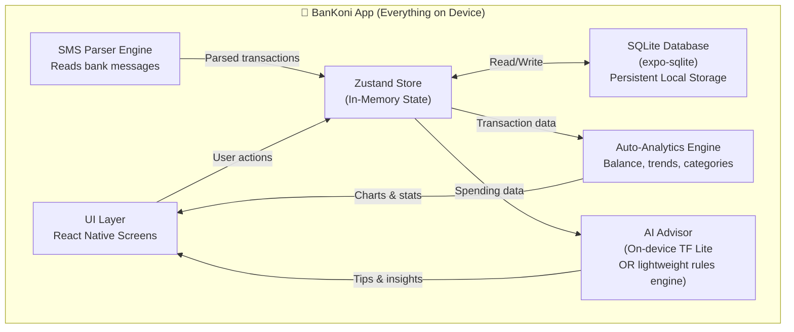

# 🏦 MoniVO → BanKoni — Full Project Analysis & Roadmap

---

## 1. Where We Are Right Now

### ✅ What's Built & Working (Frontend)

| Area | Status | Files |
|------|--------|-------|
| **Auth Screens** | ✅ Complete | `LoginScreen.tsx`, `RegisterScreen.tsx`, `OnboardingScreen.tsx` |
| **Home Dashboard** | ✅ Complete | `HomeScreen.tsx` + Balance Cards, Spending Chart, Budget Preview, Recent Transactions | 
| **Transactions** | ✅ Complete | Full CRUD — Add/Edit/Delete with modals, filtering, search |
| **Budgets** | ✅ Complete | Full CRUD — Add/Edit/Delete with category linking, progress bars |
| **Analytics** | ✅ Complete | Charts, category breakdowns, spending trends |
| **Navigation** | ✅ Complete | Tab navigator (Home, Transactions, Budgets, Analytics) + Auth stack |
| **State Management** | ✅ Complete | Zustand store with computed getters (balance, income, expenses) |
| **Theming** | ✅ Complete | Dark/Light mode with custom color palette |
| **Type System** | ✅ Complete | Transaction, Budget, Category, Wallet, User TypeScript interfaces |
| **Dummy Data** | ✅ Complete | Realistic test data with ETB currency |

### ⚠️ What's Half-Done

| Area | Issue |
|------|-------|
| **Backend Connection** | Store has API calls via Axios → but **no backend exists** — falls back to dummy data |
| **Data Persistence** | Only auth token saved to SecureStore; **transactions/budgets are in-memory only** (lost on app restart) |
| **Wallet Balances** | Wallets exist as types but **balance isn't auto-calculated** from transactions |

### ❌ What's Missing Entirely

| Area | Description |
|------|-------------|
| **Local Database** | No SQLite/MMKV — everything resets on restart |
| **SMS/Message Parsing** | No text message analysis at all |
| **AI Assistant** | No AI features |
| **Auto-categorization** | Transactions must be manually categorized |
| **Real Balance Tracking** | Balance computed from dummy data, not real transaction history |

---

## 2. The BanKoni Vision — What We're Building

**BanKoni** = A **fully local-first** personal finance app that:

1. 🗄️ **Stores everything on-device** — no remote server needed
2. 📱 **Reads & parses SMS/messages** — auto-detects bank transactions (CBE, Telebirr, Awash, etc.)
3. 📊 **Auto-sets analytics, standardization & balance** — computed in real-time from transaction data
4. 🤖 **Embedded AI advisor** — gives spending insights, saving tips, budget suggestions
5. 🏷️ **Auto-categorizes** — uses patterns + AI to classify transactions

---

## 3. Architecture — Local-First, No Backend Server



> [!IMPORTANT]
> **No backend server.** All data lives in SQLite on the phone. Auth becomes local PIN/biometric. The Axios API layer gets replaced entirely.

---

## 4. Step-by-Step Execution Plan

### Phase 1: 🏷️ Rebrand — MoniVO → BanKoni
> *~30 minutes — cosmetic rename across all files*

- [ ] Rename in `app.json` (name, slug)
- [ ] Rename in both `package.json` files
- [ ] Rename Zustand store: `useMoniVoStore.ts` → `useBanKoniStore.ts`
- [ ] Update all imports referencing the old name
- [ ] Update `DOCUMENTATION.md`, all docs
- [ ] Update UI text (splash, onboarding, any "MoniVo" strings)

### Phase 2: 🗄️ Local Database (SQLite)
> *Core foundation — everything depends on this*

- [ ] Install `expo-sqlite` (v54 compatible)
- [ ] Design schema:
  ```sql
  -- Users (single local user, PIN-protected)
  CREATE TABLE users (
    id TEXT PRIMARY KEY,
    name TEXT, pin_hash TEXT, avatar_url TEXT,
    created_at TEXT DEFAULT CURRENT_TIMESTAMP
  );

  -- Transactions
  CREATE TABLE transactions (
    id TEXT PRIMARY KEY,
    amount REAL NOT NULL,
    type TEXT CHECK(type IN ('CREDIT','DEBIT')),
    category_id TEXT, note TEXT, date TEXT,
    status TEXT DEFAULT 'CLEARED',
    wallet_id TEXT, source TEXT DEFAULT 'manual',
    raw_sms TEXT, -- original SMS if auto-parsed
    created_at TEXT DEFAULT CURRENT_TIMESTAMP
  );

  -- Budgets
  CREATE TABLE budgets (
    id TEXT PRIMARY KEY,
    category_id TEXT, limit_amount REAL,
    start_date TEXT, end_date TEXT,
    recurring TEXT DEFAULT 'monthly',
    alert_threshold REAL DEFAULT 0.8
  );

  -- Categories (pre-seeded + user-created)
  CREATE TABLE categories (
    id TEXT PRIMARY KEY,
    name TEXT, icon_key TEXT, color_key TEXT,
    flow TEXT CHECK(flow IN ('EXPENSE','INCOME')),
    essential INTEGER, recurring INTEGER,
    is_built_in INTEGER, is_custom INTEGER
  );

  -- Wallets
  CREATE TABLE wallets (
    id TEXT PRIMARY KEY,
    name TEXT, icon TEXT, currency TEXT DEFAULT 'ETB',
    is_default INTEGER DEFAULT 0,
    created_at TEXT DEFAULT CURRENT_TIMESTAMP
  );
  -- Note: wallet balance = SUM(CREDIT) - SUM(DEBIT) for that wallet_id
  ```
- [ ] Create `db/` module with typed CRUD helpers
- [ ] Migrate Zustand store: remove Axios calls → read/write from SQLite
- [ ] Remove `utils/api.ts` and Axios dependency
- [ ] Replace auth flow: remove JWT/SecureStore token → local PIN or direct entry

### Phase 3: 📱 SMS/Message Parsing Engine
> *The killer feature — auto-imports bank transactions*

- [ ] Install `expo-sms` or use `react-native-get-sms-android` (for Android SMS reading)
- [ ] Build parser for Ethiopian bank message formats:
  ```
  // CBE format example:
  "Dear Customer, ETB 500.00 has been debited from your account 1000XXXXXXXX on 03/10/2026. Bal: ETB 12,450.00"

  // Telebirr format:
  "You have received ETB 1,200.00 from 09XXXXXXXX. Your balance is ETB 5,600.00"

  // Awash Bank, Bank of Abyssinia, etc.
  ```
- [ ] Parse key fields: `amount`, `type` (credit/debit), `date`, `balance`, `sender`
- [ ] Auto-detect wallet (CBE → "CBE Bank" wallet, Telebirr → "Telebirr" wallet)
- [ ] **NOT just international** — parse local Ethiopian bank SMS, Telebirr, M-Pesa, any financial message
- [ ] Dedup engine: don't re-import already-parsed messages
- [ ] User review flow: "We found 3 new transactions from your messages → Confirm?"

### Phase 4: 📊 Auto-Analytics, Standardization & Balance
> *Everything computes automatically from real data*

- [ ] **Auto-balance**: Wallet balance = `SUM(credits) - SUM(debits)` per wallet, real-time
- [ ] **Auto-analytics**: Daily/weekly/monthly spend breakdowns computed from SQLite aggregation queries
- [ ] **Standardization**: Normalize all amounts to ETB, consistent date formats, unified category mapping
- [ ] **Auto-budget tracking**: Budget `spent` = `SUM(debits WHERE category_id = X AND date BETWEEN start/end)`
- [ ] **Smart alerts**: Notify when approaching budget limit (80%+ threshold)
- [ ] Upgrade `AnalyticsScreen` with richer auto-computed charts

### Phase 5: 🤖 AI Advisor — "Koni" Assistant
> *Lightweight, runs on-device, gives financial tips*

**Feasibility: YES — 100% possible.** Two approaches:

| Approach | Pros | Cons |
|----------|------|------|
| **Rules Engine** (recommended first) | No internet needed, instant, lightweight, 100% private | Less "smart", needs manual rule writing |
| **On-device TF Lite model** | More adaptive, learns patterns | Larger binary, more complexity |
| **API-based (Gemini)** | Most powerful, conversation-style | Needs internet, costs money |

**Recommended: Start with Rules Engine → add Gemini API later as optional**

- [ ] Build `KoniAdvisor` module that analyzes spending patterns:
  - "You spent 40% more on Food this week vs last week"
  - "Your Telebirr balance is running low"  
  - "You're on track with your Transport budget (62% used, 70% of month passed)"
  - "Tip: You have 3 recurring subscriptions totaling ETB 850/month"
  - "Saving idea: Reduce eating out by ETB 200/week to save ETB 10,400/year"
- [ ] Display in a dedicated **"Koni" tab** or bottom-sheet advisor
- [ ] Optional: Add Gemini API integration for chat-style Q&A about finances (requires internet)

### Phase 6: 💅 Polish & Ship
- [ ] New BanKoni branding (colors, logo, splash screen)
- [ ] Onboarding flow for SMS permission + initial setup
- [ ] Export data (CSV/PDF)
- [ ] Backup/restore (encrypted local backup)

---

## 5. What Changes in the Codebase

| Current (MoniVO) | New (BanKoni) |
|---|---|
| `useMoniVoStore.ts` with Axios API calls | `useBanKoniStore.ts` with SQLite reads/writes |
| `utils/api.ts` (Axios + ngrok) | **Deleted** — no remote API |
| Auth via JWT token | Local PIN/biometric or passthrough |
| Dummy data on every restart | SQLite persistent database |
| Manual transaction entry only | SMS auto-import + manual entry |
| Basic computed analytics | Rich auto-analytics engine |
| No AI | Koni Advisor (rules + optional Gemini) |
| Name: "MoniVO" | Name: **"BanKoni"** |

---

## 6. New Dependencies Needed

```json
{
  "expo-sqlite": "~57.x.x",
  "react-native-get-sms-android": "latest",
  "expo-notifications": "~57.x.x",
  "expo-local-authentication": "~57.x.x"
}
```

> [!NOTE]
> SMS reading on **iOS is not possible** due to Apple restrictions. This feature will be Android-only. iOS users can manually add transactions or potentially use notification parsing as an alternative.

---

## 7. Recommended Execution Order

```
Phase 1 (Rebrand)  →  Phase 2 (SQLite)  →  Phase 3 (SMS)  →  Phase 4 (Auto-Analytics)  →  Phase 5 (AI)  →  Phase 6 (Polish)
     30 min              2-3 hours           2-3 hours            1-2 hours               2-3 hours         1-2 hours
```

> [!TIP]
> **Start with Phase 1 + 2 together.** Rebranding is quick, and SQLite is the foundation everything else builds on. Once data persists locally, SMS parsing and AI become straightforward additions.

---

## 8. Answer: Is This Possible?

**Yes, absolutely.** Here's why:

- ✅ **Local storage** → `expo-sqlite` is mature and works perfectly for this
- ✅ **SMS parsing** → Android allows reading SMS with permission; Ethiopian bank formats are parseable with regex
- ✅ **Auto-analytics** → Just SQL aggregation queries on local data
- ✅ **AI advisor** → Rules-based engine needs zero internet; Gemini API is optional upgrade
- ✅ **No backend needed** → Everything runs on the phone

The frontend is already ~80% built. We're replacing the "backend" concept with an on-device database and adding intelligence on top.


                               ┌────────────────────────────────────────────────┐
                               │           📱 BanKoni Mobile App                │
                               │                                                │
   [ Cardholder Name ]         │   ┌────────────────────────────────────────┐   │
   [ @Nickname       ] ───────>│   │  Auth Layer: 4-Digit PIN + Biometrics  │   │
   [ 4-Digit PIN     ]         │   └───────────────────┬────────────────────┘   │
   [ Biometrics      ]         │                       │                        │
                               │                       ▼                        │
                               │   ┌────────────────────────────────────────┐   │
                               │   │   Zustand Store (useBanKoniStore.ts)   │   │
                               │   │       Fast in-memory UI cache          │   │
                               │   └───────────────────┬────────────────────┘   │
                               │                       │                        │
                               │                       ▼                        │
                               │   ┌────────────────────────────────────────┐   │
                               │   │    SQLite Engine (bankoni.db)          │   │
                               │   │   PRAGMA journal_mode = WAL            │   │
                               │   │   Tables: users, tx, budgets, wallets  │   │
                               │   └───────────────────┬────────────────────┘   │
                               │                       │                        │
                               └───────────────────────┼────────────────────────┘
                                                       │
                                                       ▼
                                         ┌───────────────────────────┐
                                         │  Export to JSON File      │
                                         │  (expo-file-system / share│
                                         │  Ready for Telegram Bot)  │
                                         └───────────────────────────┘
